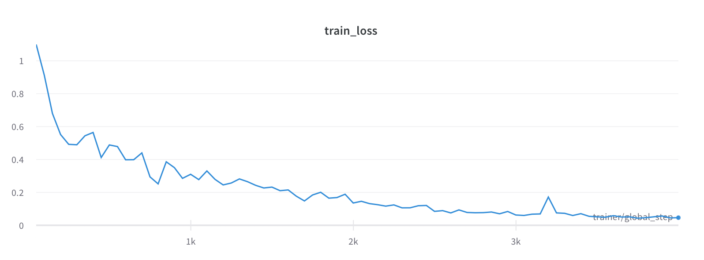

# Floorplan recognition model

### Dataset

Dataset from default configuration is automatically downloaded from http://silentz.ml/newyork.zip.
In case domain has expired, you can download archive manually and unpack it to `data/` directory inside project
root. _NOTE: you can download newyork.zip from github releases of this repository_.
Final `data/` directory layout should look like this:

```
data/
├── newyork
│   ├── test/
│   └── train/
└── newyork.zip
```

### Training losses

`train_loss` - model training CE loss



### How to reproduce

1. Clone repository:
```bash
git clone https://github.com/silentz/floorplan-model.git
```

2. Cd into repository root:
```bash
cd floorplan-model
```

3. Create and activate virtualenv:
```bash
virtualenv --python=python3 venv
source venv/bin/activate
```

4. Install required packages:
```bash
pip install -r requirements.txt
```

5. Download dataset (should be automatic, but if not, see section above).

6. Train model:
```bash
python -m train fit --config train/configs/config.yaml
```

7. Create torchscript model:
```bash
python -m train.export --config train/configs/config.yaml --from_ckpt checkpoints/epoch=0-step=4000.ckpt
```

8. Run inference script:
```bash
python infer.py export/model.pt sample.jpg
```
